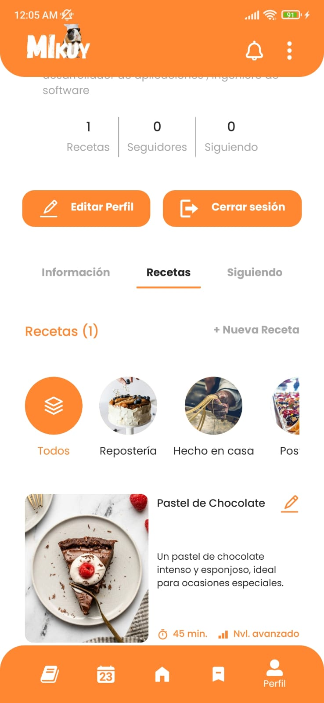
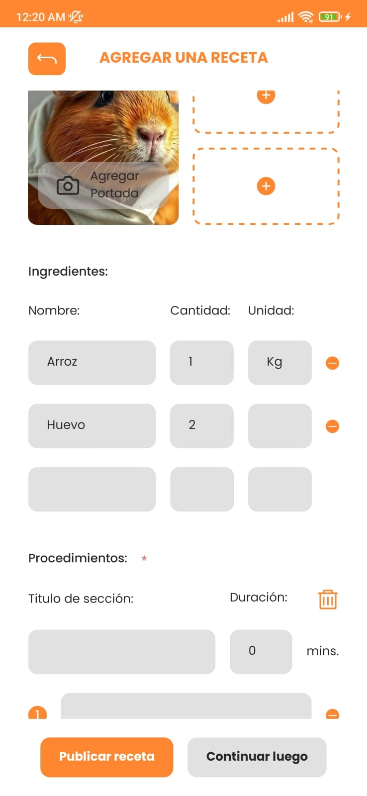
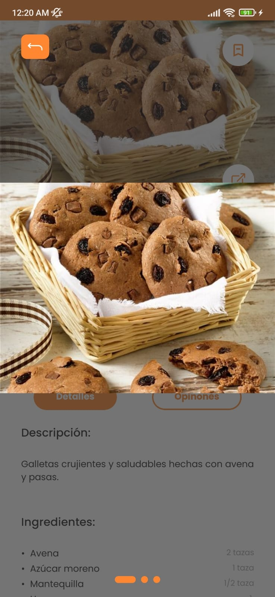

# Recipe Book App - Mikuy - React Native

Una aplicación de recetario virtual, que permite al usuario amante de la cocina, guardar, crear y postear recetas innovadoras y ampliamente personalizadas para todo tipo de gustos.

keywords: CoderHouse, React Native, App, CookBook, Multiplatform, javascript

project start date: 16 July 2024

project presentation date: 22 Sep 2024

app version: 1.0.0

## 1. Main features of the application

### 1.1. Authentication and support for unauthenticated users

<div style="display: flex; gap: 60px;">


</div>

### 1.2. Home screen, popular and recommended recipes

<div style="display: flex; gap: 60px;">


</div>

### 1.3. CookBook screen, recipe search and filtering

<div style="display: flex; gap: 60px;">


</div>

### 1.4. Marked Recipes screen


### 1.5. Profile screen, user photo, created recipes

<div style="display: flex; gap: 60px;">



</div>

### 1.6. Profile Edit screen, name, description, ...

<div style="display: flex; gap: 60px;">


</div>

### 1.7. Create Recipes screen



### 1.8. Recipe screen, images, description & procedures

<div style="display: flex; gap: 60px;">


</div>

### 1.9. Recipe comments & rating

<div style="display: flex; gap: 60px;">


</div>

## 2. Technologies and tools used

### 2.1. React Native

Utilizado como el marco principal para desarrollar la aplicación móvil, permitiendo crear una interfaz de usuario nativa tanto para Android como para iOS usando JavaScript y componentes reutilizables.

### 2.2. React Native Navigation Stack

Implementado para manejar la navegación entre diferentes pantallas de la aplicación, proporcionando una experiencia de usuario fluida y organizada a través de pilas de navegación.

### 2.3. React Native Animated

Usado para agregar animaciones y transiciones visuales a la aplicación, mejorando la interactividad y la experiencia del usuario al hacer que las interfaces sean más dinámicas y atractivas.

### 2.4. React Native Async Storage

Empleada para el almacenamiento local de datos clave-valor, usando SQLite, permite mantener datos importantes como configuraciones, sesiones de usuario o preferencias de forma persistente en el dispositivo del usuario.

### 2.5. Expo

Utilizado como un conjunto de herramientas y servicios que facilita el desarrollo y la implementación de la aplicación en dispositivos móviles, proporcionando funcionalidades adicionales como acceso a la cámara, almacenamiento, etc.

### 2.6. Expo Image Picker

Implementado para permitir a los usuarios seleccionar imágenes desde la galería o tomar fotos con la cámara, integrando fácilmente esta funcionalidad en la aplicación.

### 2.7. Expo Fonts

Usado para cargar y personalizar fuentes dentro de la aplicación, mejorando la apariencia y el estilo de la interfaz de usuario.

### 2.8. Redux

Utilizado para la gestión del estado global de la aplicación, permitiendo un manejo más eficiente y centralizado del estado de los datos y su propagación entre los diferentes componentes.

### 2.9. RTK Query

Implementado para simplificar las operaciones de obtención, almacenamiento y sincronización de datos desde la API en la aplicación, agilizando el manejo de peticiones y respuestas.

### 2.10. Firebase Authentication

Usado para gestionar la autenticación de usuarios, permitiendo el registro, inicio de sesión y verificación de usuarios de forma segura.

### 2.11. Firebase Realtime Database (Rest API)

Empleada para almacenar y sincronizar datos en tiempo real a través de la API REST, permitiendo a la aplicación acceder y actualizar la información de forma rápida y eficiente.

### 2.12. Firebase Cloud Storage

Utilizado para almacenar y gestionar archivos multimedia, como imágenes, proporcionando un almacenamiento escalable y seguro para los activos de la aplicación.

### 2.13. Figma

Usado como herramienta de diseño para crear y prototipar la interfaz de usuario, permitiendo visualizar y planificar la estructura y apariencia de la aplicación antes de la implementación.

### 2.14. VSCode

Empleado como el editor de código principal, proporcionando un entorno de desarrollo eficiente y personalizable para escribir y depurar el código de la aplicación.

## 3. App architecture & design

### 3.1. Database architecture

Se diseñó la base de datos NoSQL con un enfoque en la eficiencia y seguridad de los datos. Para evitar la redundancia y la duplicación de información, se implementó un esquema en el que cada colección maneja identificadores únicos (ID) para establecer relaciones entre los registros. Esto garantiza que los datos no se repitan innecesariamente y facilita el mantenimiento y actualización de la información. Además, se separaron ciertos campos y documentos en colecciones independientes, lo que permite un acceso más seguro y eficiente a los documentos según las necesidades del sistema, optimizando así tanto la escalabilidad como la integridad de la base de datos.

[Documento de arquitectura](docs/Data%20Base%20Architecture.md)

### 3.2. UI design

Para el diseño de la interfaz de usuario (UI) de la aplicación de recetario, se utilizó Figma como herramienta principal, permitiendo crear y prototipar cada una de las pantallas de la app de manera detallada y efectiva. La herramienta facilitó la creación de un diseño cohesivo y visualmente atractivo, asegurando que la experiencia del usuario fuera intuitiva y agradable.

En la fase inicial del proyecto, se crearon gráficos de baja fidelidad (wireframes) que sirvieron como guías estructurales para definir la disposición y la funcionalidad básica de cada pantalla. Estos bocetos de baja fidelidad proporcionaron una visión clara de la navegación y la jerarquía de información dentro de la aplicación, ayudando a establecer un flujo de usuario lógico y permitiendo realizar ajustes tempranos antes de pasar a un diseño más detallado.

Creditos de Diseño: [Valery Andrea Delgado de la Cruz](#7-contact)

[Mikuy UI design](https://www.figma.com/design/YNCdpczyLHCPDkMeZYovsO/Mikuy-App?node-id=2-2&t=X98abTYheGYU2Npa-1)

## 4. App security

La seguridad de la aplicación se enfoca en proteger los datos de los usuarios y controlar el acceso a la información y operaciones dentro de la app. Esto se logra mediante la implementación de reglas de seguridad que garantizan que solo usuarios autenticados puedan realizar ciertas acciones, como leer o escribir datos. Además, se asegura que los usuarios solo puedan modificar su propia información, evitando accesos no autorizados.

### 4.1. Lectura y Escritura Global:

- .read: Todos pueden leer la base de datos (true).
- .write: Está deshabilitado de forma global (false) excepto para reglas específicas.

### 4.2. Colección de users:

- Los usuarios autenticados pueden leer cualquier perfil.
- Solo un usuario puede modificar su propio perfil (auth.uid === $userId).
- Cualquier usuario autenticado puede seguir a otro (followers).
- El campo verified es de solo lectura y no se puede modificar.

### 4.3. Colección de recipes:

- Todos pueden leer las recetas.
- Solo los usuarios autenticados pueden crear recetas y modificar las que ellos mismos hayan creado.
- Los índices (.indexOn) permiten búsquedas más eficientes por categoryId, authorId, duration, etc.
- Cualquier usuario autenticado puede agregar una calificación (rating), pero solo el autor puede modificar o agregar calificaciones específicas.

### 4.4. Colección de categories:

- Las categorías son de solo lectura para todos los usuarios.

### 4.5. Database rules:

```
{
  "rules": {
    ".read": "true",
    ".write": "false",
    "users": {
      "$userId": {
        ".read": "true",
        ".write": "auth !== null && auth.uid === $userId",
        "followers": {
          ".write": "auth !== null"
        },
        "verified" : {
          ".write": "false"
        }
      }
    },
    "recipes": {
      ".indexOn": ["categoryId", "authorId", "duration", "createdAt", "difficulty", "rating/averageRating"],
      "$recipeId": {
        ".read": "true",
        ".write": "auth !== null && ((!data.exists() && newData.child('authorId').val() === auth.uid) || (data.exists() && data.child('authorId').val() === auth.uid))",
        "rating": {
          "$others": {
          	".write": "auth !== null",
          },
          "individualRating" : {
            "$reviewId": {
              ".write": "auth !== null && (
                (!data.exists() && newData.child('authorId').val() === auth.uid) ||
                (data.exists() && data.child('authorId').val() === auth.uid)
              )"
            }
          }
        }
      }
    },
    "categories": {
      "$categoryId": {
        ".read": "true"
      }
    }
  }
}
```

## 5. App installing and running

Requisitos Previos

1. Node.js y npm: Asegúrate de tener Node.js y npm instalados. Puedes verificar la instalación ejecutando node -v y npm -v en tu terminal.
2. Expo CLI: Si aún no lo tienes, instala Expo CLI de forma global: `npm install -g expo-cli`
3. Dispositivo físico o emulador:

- Expo Go: Descarga la aplicación Expo Go en tu dispositivo Android o iOS para probar la aplicación de manera rápida y fácil.
- Android Studio: Si prefieres un emulador, asegúrate de instalar Android Studio y configurar un emulador de Android. También asegúrate de habilitar la virtualización en la configuración de tu BIOS.

Pasos para Iniciar el Proyecto (Expo, Firebase y React Native)

1. Clona el repositorio: `git clone https://github.com/JoshuaPariona/Mikuy.git`
2. Instala las dependencias: `npm install`
3. Configura las claves de API para servicios externos (Firebase).
4. Ejecuta la aplicación: `npm start`

## 6. Coming Soon

Siguientes Pasos para el Desarrollo de la App

### 6.1. Agregar Nuevas Funcionalidades:

- Pantallas de Horario de Comidas: Diseñar y desarrollar pantallas que permitan a los usuarios gestionar sus horarios de comidas.
- Pantallas de Usuario: Crear perfiles de usuario donde se puedan ver recetas, seguidores y actividad reciente.

### 6.2. Implementar Características de Seguimiento:

- Permitir a los usuarios seguir a otros usuarios.
- Desarrollar una funcionalidad para ver las recetas y actividades de los usuarios que siguen.

### 6.3. Configuración de la App:

- Diseñar una sección de configuración donde los usuarios puedan ajustar preferencias, notificaciones y otras opciones personales.

### 6.4. Inicio de Sesión con Proveedores Externos:

- Implementar autenticación con Google y Facebook para facilitar el inicio de sesión de los usuarios.

### 6.5. Optimización del Lado del Servidor:

- Cloud Functions: Implementar funciones en la nube para manejar tareas como notificaciones, procesamiento de imágenes o cualquier lógica que requiera ejecución en el servidor.
- Seguridad y Rendimiento: Asegurarse de que las reglas de seguridad en Firebase estén bien definidas y optimizar las consultas a la base de datos para mejorar la velocidad de carga.

### 6.6. Pruebas y Ajustes:

- Realizar pruebas de usuario para identificar áreas de mejora.
- Recopilar feedback y hacer ajustes según las necesidades de los usuarios.

### 6.7. Documentación:

- Actualizar la documentación del proyecto para incluir nuevas funcionalidades y configuraciones.

### 6.8. Despliegue y Mantenimiento:

- Preparar la aplicación para su lanzamiento en las tiendas de aplicaciones.
- Establecer un plan de mantenimiento para futuras actualizaciones y mejoras.

## 7. Contact

### Email: joshiparsa@gmail.com

### Whatsapp: +51 945 368 569

### Linkedin: [Joshua Bryan Pariona Santiago](https://www.linkedin.com/in/joshua-bryan-pariona-santiago-7a808727b)

---

### Email: delgadodelacruzvaleryandrea@gmail.com

### Whatsapp: +51 945 409 297

### Linkedin: [Valery Andrea Delgado de la Cruz](https://www.linkedin.com/in/valery-andrea-delgado-de-la-cruz-119a6a2bb/)
